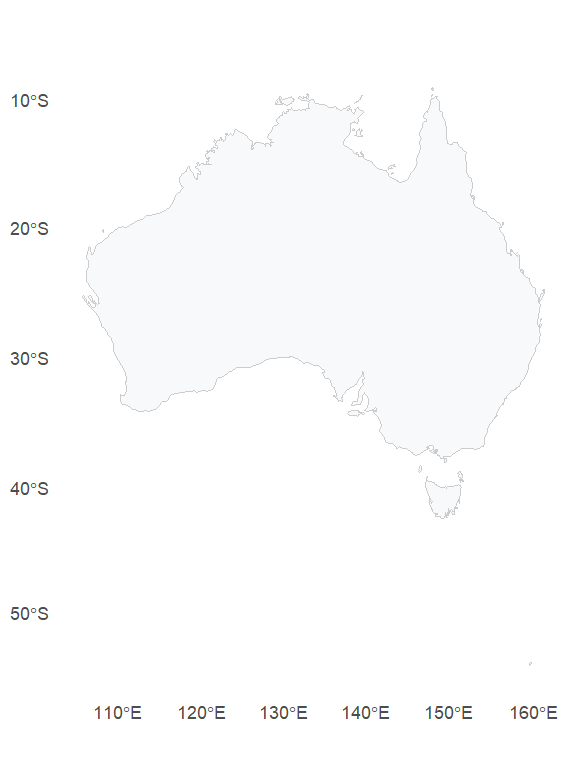
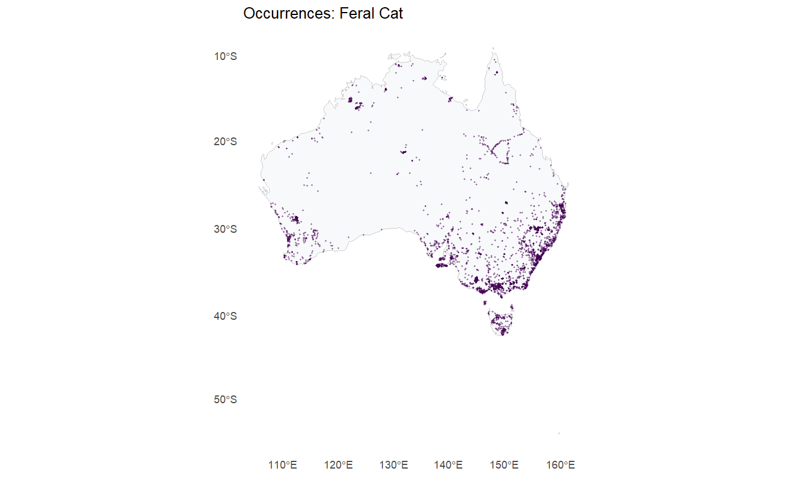
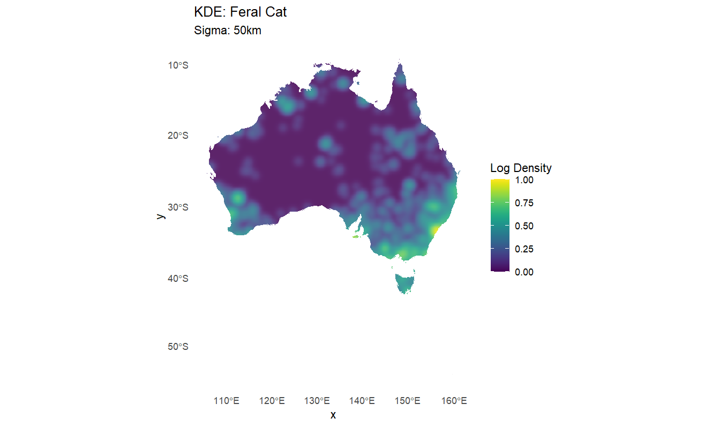
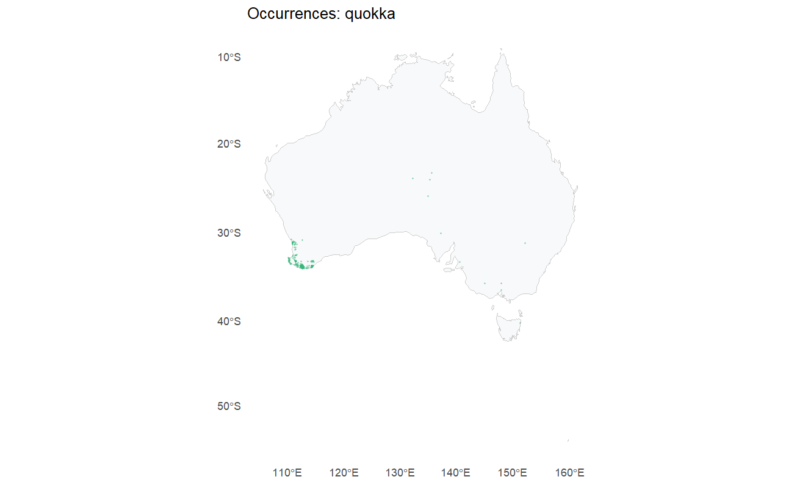
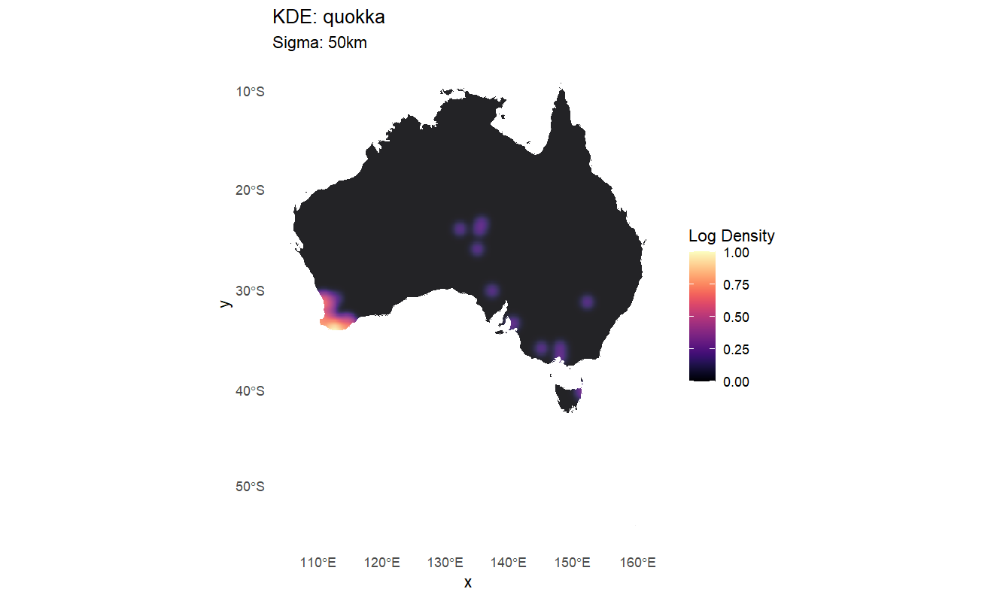
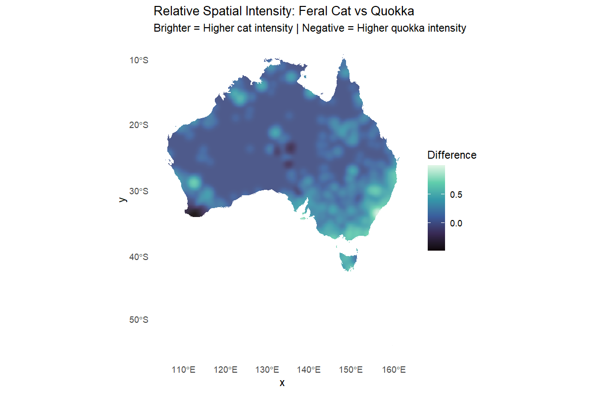

# Predator - vulnerable Prey Spatial Interaction Analysis: Feral Cat (Felis catus) vs. Quokka (Setonix brachyurus) in Australia

Final project of Spatial Ecology in R

Author: Eleonora Ramilli

This project explores the spatial relationship between feral cats and quokkas across Australia using GBIF occurrence data and Spatial Point Pattern Analysis. The aim is to investigate whether areas with high relative occurrence of feral cats are associated with reduced occurrence of quokkas and wheter these animals can be a threat for the populations of native species in a very limited part of the world.

## Research Question:

Are areas with high occurrence intensity of feral cats associated with areas of low quokka occurrence in Australia?

The ecological hypothesis is that feral cats may negatively affect quokkas through predation, particularly in mainland populations where quokkas are exposed to introduced predators. Therefore, we expect areas with high feral cat occurrence to show lower relative quokka occurrence.

The quokka (Setonix brachyurus) has a highly restricted distribution in southwestern Western Australia, including mainland populations and several islands, while Felis catus is an introduced species occurring widely across Australia. GBIF recognizes Felis catus as introduced in Australia, while Setonix brachyurus is the accepted scientific name for the quokka.

# Data and Methodology

Data was downloaded using GBIF through the rgbif package. Occurrence records for feral cats and quokkas were obtained and cleaned to ensure data integrity.

Both occurrence data and Kernel Density Estimations were obtained and projected onto the Australian map. A common KDE bandwidth was used for both species so that their spatial patterns could be compared using the same spatial scale.

For the coordinate system, all data was projected to an appropriate Australian metric coordinate system, allowing distance-based calculations to be performed in metres and not in degrees.
A log-transformation was applied to the density surfaces to handle the high variance in occurrence intensity and highlight subtle spatial patterns. The resulting surfaces were normalized between 0 and 1.

Finally, a Spearman rank correlation was calculated between the two density surfaces. In addition, a density-difference map was produced to identify areas where feral cat occurrence intensity is relatively higher or lower than quokka occurrence intensity.

The analysis was performed entirely in R.

## Packages used

Here are the packages used in the project.

- `rgbif` allows R to access GBIF servers and download occurrence records.
- `sf` treats geographic data such as points and polygons as spatial objects, allowing them to be cropped, projected and transformed.
- `spatstat` was used to create Point Pattern objects (ppp) and calculate Kernel Density Estimations.
- `rnaturalearth` provided Australia's borders used as the observation window.
- `viridis` provided colour scales designed to be accessible, including for colour-blind readers.
- `ggplot2` was used to build maps and charts.

## Study Area

Before loading the occurrence data, we define Australia as the study area.

Because the analysis involves distance calculations and KDE bandwidths, the geographic data must be transformed from latitude and longitude into a projected coordinate system measured in metres.

For a nationwide Australian analysis, GDA2020 / Australian Albers (EPSG:3577) is the most suitable choice because it is designed for continental Australia and provides distances in metres.

We load the Australian map and immediately transform it into an Australian metric projection.

```R 
australia <- ne_countries(
  country = "Australia",
  scale = "medium",
  returnclass = "sf"
) |>
  st_transform(3577)

# We transform the map into the observation window
# used later for the ppp objects.
australia_poly <- as.owin(australia)

# We visualize Australia without occurrence data.
ggplot() +
  geom_sf(
    data = australia,
    fill = "#f8f9fa",
    color = "grey80",
    linewidth = 0.2
  ) +
  theme_minimal() +
  theme(panel.grid = element_blank())

```




<small> *Figure 1: Map of Australia without occurrence data.*


An important ecological feature of this study area is that the two species have very different distributions. Feral cats occur across much of Australia, whereas quokkas have a much more restricted distribution concentrated in southwestern Western Australia and several islands. GBIF's taxonomic information identifies Setonix brachyurus as the quokka and documents its restricted southwestern Australian distribution.

## Data Acquisition

We retrieve occurrence data from GBIF.
The two species are:

Feral cat - Felis catus 

Quokka - Setonix brachyurus

The GBIF taxonomic records identify Felis catus as the accepted species and list several domestic-cat synonyms.
For the quokka, the current accepted scientific name is Setonix brachyurus.
We also ensure that no NA values are present in our data, and that all our points intersect with the Australian border (no points outside our study area). 
```R
#Function used to download and clean species occurrence data.

load_species_sf <- function(taxonKey) {

# Download occurrence records from GBIF.
# We require geographic coordinates and restrict
# the records to Australia.

data <- occ_search(
  taxonKey = taxonKey,
  country = "AU",
  hasCoordinate = TRUE,
  limit = 10000
)$data

# Keep only the columns required for the analysis.
  data <- data[, c(
    "decimalLongitude",
    "decimalLatitude",
    "scientificName"
  )]

# Remove records without coordinates.
  data <- data[
    !is.na(data$decimalLongitude) &
    !is.na(data$decimalLatitude),
  ]

# Remove duplicated coordinates.
# This prevents repeated records from producing artificial density hotspots.
  data <- data[
    !duplicated(
      data[, c("decimalLongitude", "decimalLatitude")]
    ),
  ]

  # Convert the table into an sf spatial object.
  sf_points <- st_as_sf(
    data,
    coords = c("decimalLongitude", "decimalLatitude"),
    crs = 4326
  ) |>
    st_transform(3577)

  # Keep only points occurring inside Australia.
  return(
    sf_points[
      st_intersects(
        sf_points,
        australia,
        sparse = FALSE
      ),
    ]
  )
}

```
We then apply the function to both species.

Important: it was decided to use the GBIF taxon keys returned by name_backbone() rather than manually assuming a numeric key, as GBIF taxonomy identifiers can change.

```R
# We find the GBIF taxon keys.

cat_taxon <- name_backbone(
  name = "Felis catus"
)

quokka_taxon <- name_backbone(
  name = "Setonix brachyurus"
)

cat_taxon$usageKey
quokka_taxon$usageKey
```

We can then download the data:

```R
feral_cat_sf <- load_species_sf(
  cat_taxon$usageKey
)

quokka_sf <- load_species_sf(
  quokka_taxon$usageKey
)
```
## Sampling Bias

An important limitation of this analysis is that GBIF data represents where observations have been recorded, rather than the true distribution or abundance of either species.

This is particularly important in Australia. Human observations are not spatially uniform. Records are more likely to occur close to places inhabited by humans like roads, cities, research stations, national parks, tourist locations, accessible islands and areas where wildlife monitoring is already occurring.
Quokkas have a naturally restricted distribution, so large parts of Australia will contain no quokka records at all. Therefore, these areas should not automatically be interpreted as places where quokkas have disappeared.

So, throughout this project, "absence" means low or zero recorded occurrence intensity in the GBIF dataset, rather than confirmed biological absence.
This is not a problem though, as the aim of the project is to prove that feral cats are, as already known, a threat for this native species.


## Kernel Density Estimation and Normalization

To compare the spatial distributions of the two species, we convert their discrete occurrence points into continuous density surfaces.

This allows us to understand where is feral cat occurrence relatively high, and where is quokka occurrence relatively high.

We first convert both datasets into Point Pattern objects.

This is required by the `spatstat` package that links the occurrence points to our defined geographic window which is Australia

```R
# Creation of the ppp objects, we extract X and Y coordinates in meters from the spatial object, 1 being the longitude and 2 the latitude.
cat_ppp <- ppp(
  st_coordinates(feral_cat_sf)[,1],
  st_coordinates(feral_cat_sf)[,2],
  window = australia_poly
)

quokka_ppp <- ppp(
  st_coordinates(quokka_sf)[,1],
  st_coordinates(quokka_sf)[,2],
  window = australia_poly
)

```
We then calculate the KDE.

Because the two species differ substantially in body size, ecology and distribution, the bandwidth should ideally be justified using the spatial scale of the question.
For a directly comparable national-scale analysis, we can use a common 50 km bandwidth.

```R
# Kernel Density Estimation.
# Sigma = 50 km.
`dimyx` is set to 512 to create a high resolution grid for the final maps. 
cat_dens <- density(
  cat_ppp,
  sigma = 50000,
  dimyx = 512
)

quokka_dens <- density(
  quokka_ppp,
  sigma = 50000,
  dimyx = 512
)
```
The large bandwidth is appropriate for a continental-scale analysis because it avoids interpreting individual observations as separate ecological hotspots.

## Log Transformation and Normalization

Species occurrence data is often highly skewed, with a few areas having massive numbers of sightings while most have very few. To account for this and compare both datasets fairly, we created the function `apply_log_norm`, that performs a logarithmic transformation. This makes subtle patterns in lower-density areas more visible alongside high-density hotspots. This function also normalizes the data, scaling the values between 0 and 1. 

The number of observations is expected to differ considerably between the two species.

Feral cats have a broad distribution and potentially many records, whereas quokka records are concentrated in a relatively small part of southwestern Australia.

The normalization performed is a Min-Max normalization, performed using the formula:

$$x_{norm}=\frac{x-min(x)}{max(x)-min(x)}$$ 

```R
#We create the Log-Normalization function for our densities, to visualize and compare them better in the plots.
apply_log_norm <- function(dens_obj) {
#We first create and add a small offset to add to every pixel, to avoid log(0) problem, so every pixel has a value.
#na.rm ignores any NA values. 
  offset <- max(
    dens_obj$v,
    na.rm = TRUE
  ) / 1000

  
  dens_obj$v <- log(
    dens_obj$v + offset
  )

  #We apply a Min-Max scaling for the normalization. Now every value is contained between 1.0 and 0.0 for both density scales. 
  dens_obj$v <- (
    dens_obj$v -
      min(dens_obj$v, na.rm = TRUE)
  ) /
    (
      max(dens_obj$v, na.rm = TRUE) -
        min(dens_obj$v, na.rm = TRUE)
    )

  return(dens_obj)
}

# We apply the transformation to our densities.

cat_dens_log <- apply_log_norm(cat_dens)

quokka_dens_log <- apply_log_norm(quokka_dens)

```
Now, every pixel has a value between 0 and 1.
A value close to 1 therefore means high relative occurrence intensity within that species, while a value close to 0 means low relative occurrence intensity.

It is important to emphasize that these are not population densities.

## Plotting Functions
Functions are used to guarantee that both species' maps have the exact same criteria used. It's also efficient, we can generate all four maps with lesser lines of code. 
### Occurrence plots

The `plot_occ` function is used to plot the individual occurrence points, so raw GBIF data, over Australia. We set `size = 0.3` and `alpha = 0.4`. Using a low alpha (transparency) is crucial; it prevents "overplotting" where points stack on top of each other, allowing us to see where sightings are most densely clustered.
```R
plot_occ <- function(
  sf_points,
  species_label,
  color_p
) {

  ggplot() +

# We draw the Australia background to put the points into.
    geom_sf(
      data = australia,
      fill = "#f8f9fa",
      color = "grey80",
      linewidth = 0.2
    ) +

    #We draw the points, taking the data from our sf object created before.
    geom_sf(
      data = sf_points,
      color = color_p,
      size = 0.3,
      alpha = 0.4
    ) +

    labs(
      title = paste(
        "Occurrences:",
        species_label
      )
    ) +
    #We remove the default grey backgorund and grid lines of R, making the map look cleaner. 
    theme_minimal() +
    theme(
      panel.grid = element_blank()
    )
}
```

The low transparency prevents overplotting from hiding the spatial structure of the occurrence records.

# Density plots
```R
plot_dens <- function(
  dens_obj,
  species_label,
  palette
) {

  # Convert spatstat density object
  # into a data frame.
  df <- as.data.frame(dens_obj)
  #We put names onto the columns.
  colnames(df) <- c(
    "x",
    "y",
    "value"
  )

  ggplot() +

    # We first create the map of Australia, filled with a light grey, acting as a background, so areas with zero density still look like part of the country.
    geom_sf(
      data = australia,
      fill = "#eeeeee",
      color = NA
    ) +

    #We then draw our grid of pixels, the aes function tells R that the color of the pixel should be determined by the density number (0 to 1). Alpha is at 85% so it's still possible to see the map.
    geom_raster(
      data = df,
      aes(
        x = x,
        y = y,
        fill = value
      ),
      alpha = 0.85
    ) +
    #We set our viridis color palette
    scale_fill_viridis(
      option = palette,
      name = "Log Density"
    ) +

    # We draw the Australia borders, but this time filling NA, just putting the outline on top of the heatmap so the borders look sharp.
    geom_sf(
      data = australia,
      fill = NA,
      color = "white",
      linewidth = 0.1
    ) +

    labs(
      title = paste(
        "KDE:",
        species_label
      ),
      subtitle = "Sigma: 50 km"
    ) +
    #We remove the default grey backgorund and grid lines of R, making the map look cleaner. 
    theme_minimal() +
    theme(
      panel.grid = element_blank()
    )
}
```

# Final Layout

We now create the four maps:

```R
p1 <- plot_occ(
  feral_cat_sf,
  "Feral Cat",
  "#440154"
)

p2 <- plot_dens(
  cat_dens_log,
  "Feral Cat",
  "magma"
)

p3 <- plot_occ(
  quokka_sf,
  "Quokka",
  "#35b779"
)

p4 <- plot_dens(
  quokka_dens_log,
  "Quokka",
  "viridis"
)

p1 
p2
p3 
p4
```








<small> *Figure: Occurrence and normalized density maps of feral cats and quokkas in Australia.*

The most important visual comparison is the relationship between the two KDE maps. We are interested in whether areas of high feral-cat intensity correspond to areas of low quokka intensity.

## Statistical Analysis

Maps are useful for visual estimations of our data, but we need statistics to confirm our observations. We use two different methods: one for the raw points and one for the density surfaces.

### Spearman Rank Correlation

We calculate a pixel-by-pixel Spearman correlation between the two KDE surfaces.

```R
#We compute our Spearman Analysis, starting by converting our density matrix into a single column vector, so each grid cell becomes a single observation. 
#We use complete.obs to ignore NA values. 
#We calculate the correlation coefficient between the two vectors with the Spearman method.

spearman_rho <- cor(
  as.vector(cat_dens_log$v),
  as.vector(quokka_dens_log$v),
  method = "spearman",
  use = "complete.obs"
)

print(
  paste(
    "Spearman Correlation:",
    round(spearman_rho, 2)
  )
)
```

A positive correlation indicates that areas with high feral-cat occurrence intensity also tend to have high quokka occurrence intensity.

A negative correlation indicates that areas with high feral-cat occurrence intensity tend to have lower quokka occurrence intensity.

Therefore:
```R
$\rho > 0$ → spatial co-occurrence;
$\rho \approx 0$ → little spatial association;
$\rho < 0$ → spatial separation.
```
A strongly negative value would be consistent with the hypothesis that feral-cat occurrence is associated with reduced quokka occurrence.
The KDE pixels are spatially autocorrelated, meaning nearby pixels are not independent observations. Therefore, the Spearman coefficient should be interpreted as descriptive spatial evidence, rather than a conventional inferential statistical test.

## Density Difference Map

The density difference map is particularly useful for this project.

Instead of asking which species dominates the predator–prey relationship, we ask where is relative feral-cat occurrence higher than relative quokka occurrence

```R
#We create the Density Difference Map, showing areas where the quokka or the cat dominate. 
#We again turn the cat density matrix into a data table, giving it specific names. 

diff_df <- as.data.frame(
  cat_dens_log
)

colnames(diff_df) <- c(
  "x",
  "y",
  "cat_val"
)

# Add quokka density values, we can simply "paste" the quokka density values as a new column in our table. They line up perfectly pixel-for-pixel.

diff_df$quokka_val <-
  as.data.frame(
    quokka_dens_log
  )$value

# Calculate the difference.

diff_df$diff <-
  diff_df$cat_val -
  diff_df$quokka_val

```
We use the same logic used for the normal density maps, just changing the data used (The differences). 
```R
ggplot() +

  geom_sf(
    data = australia,
    fill = "grey95",
    color = NA
  ) +

  geom_raster(
    data = diff_df,
    aes(
      x = x,
      y = y,
      fill = diff
    ),
    alpha = 0.9
  ) +

  scale_fill_viridis_c(
    option = "mako",
    name = "Cat - Quokka"
  ) +

  geom_sf(
    data = australia,
    fill = NA,
    color = "white",
    linewidth = 0.1
  ) +

  labs(
    title = "Relative Spatial Intensity: Feral Cat vs Quokka",
    subtitle =
      "Positive = higher cat intensity | Negative = higher quokka intensity"
  ) +

  theme_minimal() +
  theme(
    panel.grid = element_blank()
  )
```


Figure 3: *Difference between normalized feral-cat and quokka occurrence intensity.*

Positive values indicate pixels where feral-cat relative occurrence is higher than quokka relative occurrence.

Negative values indicate pixels where quokka relative occurrence is higher than feral-cat relative occurrence.

Values close to zero indicate similar relative occurrence intensity.

The difference map needs to be interpreted carefully, as Australia contains enormous areas where quokkas do not naturally occur. Those areas will automatically have very low quokka density.

This is because the quokka's natural distribution is already geographically restricted. GBIF distribution information places the species primarily in southwestern Western Australia and on islands such as Rottnest and Bald Island. We have also chosen not to

Therefore, the most ecologically meaningful part of the analysis is the overlap zone between feral cats and quokkas, particularly mainland southwestern Western Australia.

# Results and Discussion

The occurrence maps show major differences between the two species.

Feral cats display a much broader distribution across Australia, reflecting their widespread establishment as an introduced species. GBIF records identify Felis catus as an introduced species in Australia.

Quokka observations, in contrast, are strongly concentrated in southwestern Western Australia, including mainland populations and island populations.

This difference creates an interesting ecological contrast.

The feral cat is a widespread introduced predator, while the quokka is a geographically restricted native marsupial. The quokka's restricted distribution means that its populations are potentially exposed to several pressures simultaneously, including habitat modification, fire, introduced predators and other forms of human disturbance.

The mainland populations are particularly interesting because they occur in landscapes where feral cats are also present.

Island populations provide a potentially useful ecological contrast. Islands such as Rottnest Island have historically provided environments where some introduced predators are absent or more strongly controlled. Therefore, comparing mainland and island occurrence patterns could help investigate whether predator pressure may contribute to differences in quokka persistence.


### Density difference map and Spearman

The Spearman Correlation is of ( ρ )=0.37, which shows not a very strong correlation between the two distributions. This is mainly due to the already seen aspect that the two animlas have very different distributions in the country, but, in the areas where they both are present, we can actually see a pressure that the predator puts on the quokkas, making it vary likely that the feral cats have a big space on the pressure the quokkas endure in their environment.

However, because KDE-derived raster values are spatially autocorrelated, the correlation should be interpreted descriptively. Spearman assumes that observations are independent, but our pixels are not, so they are pseudo replicates of nearby space. Thus, the correlation magnitude is probably artificially inflated, our result can be taken as a pattern or a descriptive interpretation but not a real statistical inference.

# Conclusion

This project investigates the spatial relationship between feral cats and quokkas in Australia using GBIF occurrence data and Kernel Density Estimation.
Thanks to the statistical analysis performed and the distribution of the two animals with the KDE, we can see that the two animals are mainly very different in their environments of choice, but we cannot ignore the area of correlation where there are both animals present, in the south-western area.

Feral cats have a widespread distribution across Australia, whereas quokkas have a much more restricted distribution, concentrated in southwestern Australia and several islands, making it possible that the feral cats have not only a strong ecological niche, but also that they actually can represent a threat for the other species, especially being that they are an introduced predator.

However, the analysis cannot fully demonstrate a causal predator–prey relationship. GBIF data is opportunistic and affected by sampling bias.

The density difference map provides a useful visualization of where feral cats have relatively greater occurrence intensity than quokkas, but it must also be interpreted in the context of the quokka's naturally restricted range.

Therefore, the strongest conclusion is that a negative spatial association between feral cats and quokkas is consistent with the hypothesis that feral-cat presence may contribute to reduced quokka occurrence.
